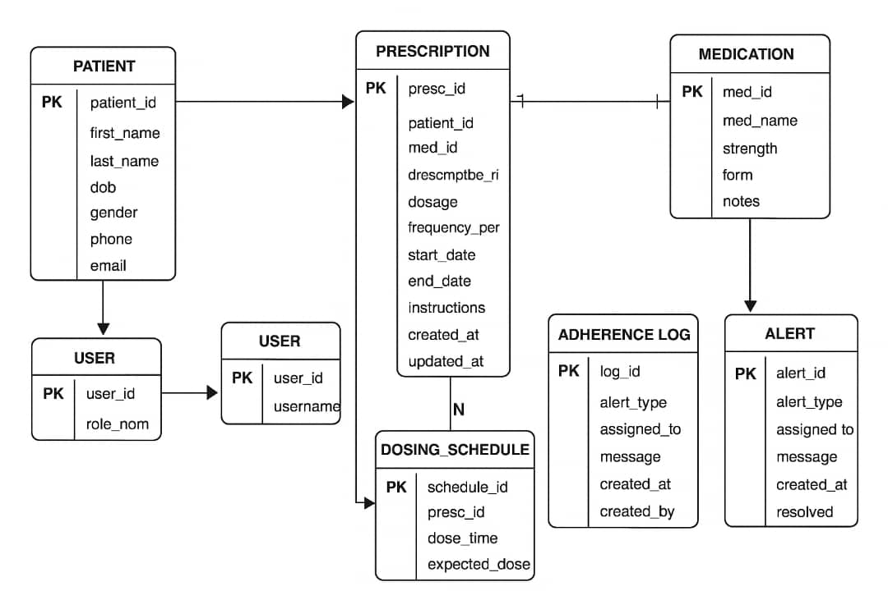
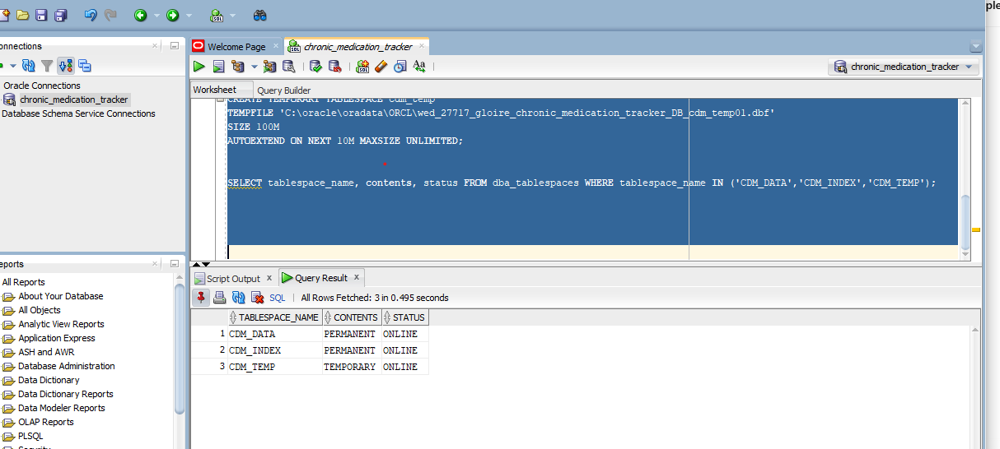
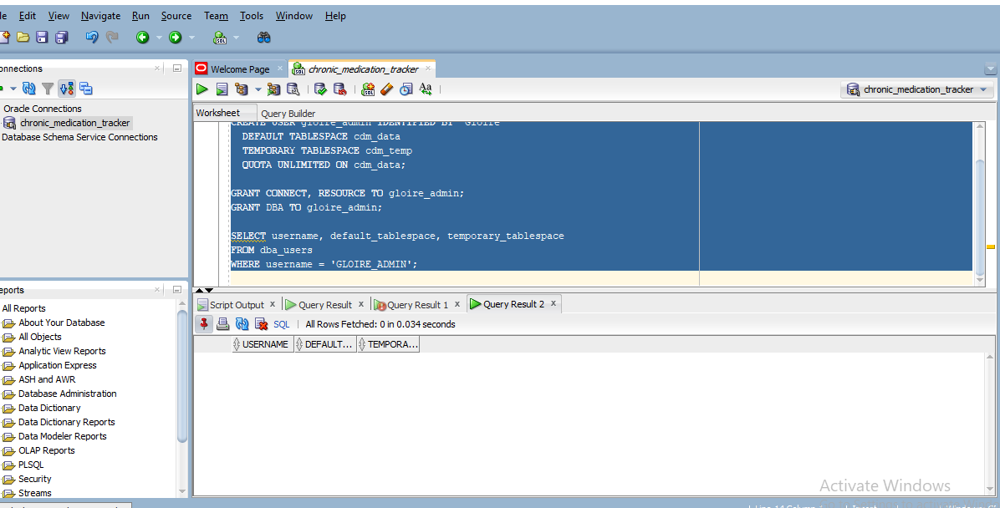
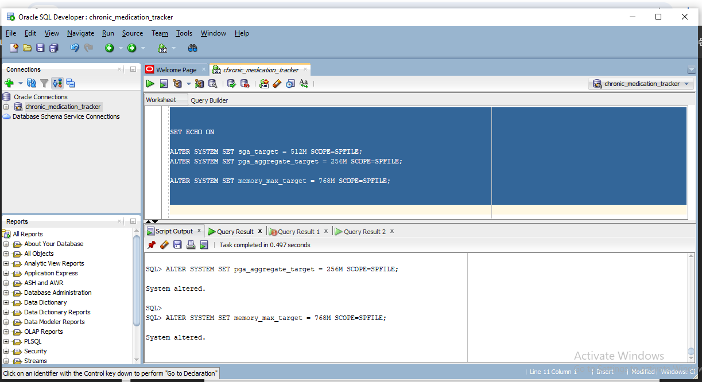

### PHASE II: BUSINESS PROCESS MODELING
## Project: Chronic Diseases Medication Adherence Monitoring System (PL/SQL Capstone)
# Scope of the Business Process
Process Name:Chronic Medication Monitoring Workflow
Domain: Healthcare MIS
Purpose: To track chronic disease patients’ medication adherence using a database-driven monitoring system.
Actors (Users)
# Actor	Role & Responsibilities
Nurse / Healthcare Provider	Registers patients enters adherence logs, reviews reports
Pharmacist	Adds medication schedules, updates dosage/frequency
Doctor: checks patien'ts health condition and take decisions 
System Administrator	Manages users, system privileges, database integrity
Patient	Provides medication compliance information


## EXPLANATION (For GitHub / Report)

Below is a clean, polished one-page text you can paste directly into your project:

Business Process Explanation — Medication Adherence Monitoring System

This business process models how chronic disease patients are monitored for proper medication adherence using a healthcare MIS built with Oracle SQL and PL/SQL. The process begins when a patient visits the healthcare facility. The nurse collects patient information and registers the patient in the database. The pharmacist reviews the patient’s condition and enters the required medication schedule into the system.

Once medication begins, the patient is expected to take doses daily. The nurse records whether each dose was taken or missed. These adherence logs are saved into the database through the ADHERENCE_LOG table.

PL/SQL triggers automatically detect missed doses and generate alerts, helping healthcare providers intervene early. A PL/SQL function calculates adherence percentage for each patient. Weekly and monthly reports are automatically generated, supporting clinical decisions and long-term disease management.

This MIS improves accuracy of patient records, strengthens follow-up, and supports data-driven healthcare. The stored data also enables analytics such as identifying high-risk patients, predicting adherence trends, and evaluating medication effectiveness. The entire process ensures coordinated work across Nursing, Pharmacy, and IT departments while supporting efficient and reliable chronic disease management.

## Entity-Relationship (ER) Model Design
 # Entities, Attributes, and Keys


| Entity            | Attributes                                                                                                             | PK               | FK                        | Notes                               |
| ----------------- | ---------------------------------------------------------------------------------------------------------------------- | ---------------- | ------------------------- | ----------------------------------- |
| Patient           | Patient_ID (NUMBER), Name (VARCHAR2), Age (NUMBER), Gender (CHAR), Chronic_Disease (VARCHAR2), Contact_Info (VARCHAR2) | Patient_ID       | -                         | Patient logs medications            |
| Medication        | Medication_ID (NUMBER), Name (VARCHAR2), Dose (VARCHAR2), Frequency (VARCHAR2), Duration (NUMBER)                      | Medication_ID    | -                         | Prescribed medications              |
| Adherence_Log     | Log_ID (NUMBER), Patient_ID (NUMBER), Medication_ID (NUMBER), Date_Taken (DATE), Status (VARCHAR2)                     | Log_ID           | Patient_ID, Medication_ID | Tracks if patient took the medicine |
| Nurse_Review      | Review_ID (NUMBER), Patient_ID (NUMBER), Log_ID (NUMBER), Review_Date (DATE), Notes (VARCHAR2)                         | Review_ID        | Patient_ID, Log_ID        | Nurse checks adherence              |
| Doctor_Review     | Doctor_Review_ID (NUMBER), Patient_ID (NUMBER), Review_Date (DATE), Diagnosis (VARCHAR2), Prescription (VARCHAR2)      | Doctor_Review_ID | Patient_ID                | Doctor reviews condition            |
| Pharmacist_Advice | Advice_ID (NUMBER), Patient_ID (NUMBER), Medication_ID (NUMBER), Advice_Date (DATE), Notes (VARCHAR2)                  | Advice_ID        | Patient_ID, Medication_ID | Pharmacist recommends adjustments   |
| Report            | Report_ID (NUMBER), Report_Type (VARCHAR2), Generated_Date (DATE), Content (CLOB)                                      | Report_ID        | -                         | MIS reports                         |

The following diagram is the ERD for the project


# Cardinalities / Relationships

Patient → Adherence_Log: 1:N (a patient can have many logs)

Medication → Adherence_Log: 1:N (a medication can be logged many times)

Patient → Nurse_Review: 1:N (a patient can have multiple reviews)

Patient → Doctor_Review: 1:N

Patient → Pharmacist_Advice: 1:N

Adherence_Log → Nurse_Review: 1:1 (each log reviewed by nurse)
# Normalization
1NF (Eliminate repeating groups)

Each table has atomic attributes (e.g., no multiple medications in one field).

2NF (Eliminate partial dependencies)

Adherence_Log depends on both Patient_ID and Medication_ID, not just one, so we separate entities properly.

3NF (Eliminate transitive dependencies)

Attributes like Doctor prescription notes only depend on Doctor_Review_ID, not on Patient_ID directly.

Nurse notes depend on Review_ID, not Patient_ID directly.
# Data Dictionary Example (Partial)
| Table         | Column     | Data Type     | Constraint                           | Description                     |
| ------------- | ---------- | ------------- | ------------------------------------ | ------------------------------- |
| Patient       | Patient_ID | NUMBER        | PK                                   | Unique patient identifier       |
| Patient       | Name       | VARCHAR2(100) | NOT NULL                             | Full patient name               |
| Adherence_Log | Status     | VARCHAR2(10)  | CHECK (Status IN ('Taken','Missed')) | Whether patient took medication |
| Doctor_Review | Diagnosis  | VARCHAR2(200) | NULLABLE                             | Doctor’s diagnosis              |
| Report        | Content    | CLOB          | NOT NULL                             | Generated adherence report      |

# BI Considerations

Fact tables: Adherence_Log (measures patient adherence)

Dimension tables: Patient, Medication, Nurse, Doctor, Pharmacist

Slowly Changing Dimensions: Track patient chronic disease changes over time

Aggregation Levels: Weekly, monthly, yearly adherence summaries

Audit Trails: Use triggers to log inserts/updates/deletes in Adherence_Log
## PHASE IV: Database Creation
 # create pdb
 ```sql
CREATE PLUGGABLE DATABASE wed_27717_gloire_chronic_medication_tracker_DB
ADMIN USER gloire_admin IDENTIFIED BY Gloire
ROLES = (DBA)
DEFAULT TABLESPACE cdm_data
DATAFILE 'C:\oracle\oradata\ORCL\wed_27717_gloire_chronic_medication_tracker_DB_data01.dbf'
    SIZE 100M AUTOEXTEND ON NEXT 10M MAXSIZE 500M
FILE_NAME_CONVERT = (
    'C:\oracle\oradata\ORCL\PDBSEED\',
    'C:\oracle\oradata\ORCL\wed_27717_gloire_chronic_medication_tracker_DB\'
);```

   # open pdb
```sql
ALTER PLUGGABLE DATABASE wed_27717_gloire_chronic_medication_tracker_DB OPEN;

ALTER PLUGGABLE DATABASE wed_27717_gloire_chronic_medication_tracker_DB SAVE STATE;
```
# creating table spaces

```sql
SET ECHO ON

CREATE TABLESPACE cdm_data
DATAFILE 'C:\oracle\oradata\ORCL\wed_27717_gloire_chronic_medication_tracker_DB_cdm_data01.dbf'
SIZE 200M
AUTOEXTEND ON NEXT 20M MAXSIZE UNLIMITED
EXTENT MANAGEMENT LOCAL;

CREATE TABLESPACE cdm_index
DATAFILE 'C:\oracle\oradata\ORCL\wed_27717_gloire_chronic_medication_tracker_DB_cdm_index01.dbf'
SIZE 100M
AUTOEXTEND ON NEXT 10M MAXSIZE UNLIMITED
EXTENT MANAGEMENT LOCAL;


CREATE TEMPORARY TABLESPACE cdm_temp
TEMPFILE 'C:\oracle\oradata\ORCL\wed_27717_gloire_chronic_medication_tracker_DB_cdm_temp01.dbf'
SIZE 100M
AUTOEXTEND ON NEXT 10M MAXSIZE UNLIMITED;


SELECT tablespace_name, contents, status FROM dba_tablespaces WHERE tablespace_name IN ('CDM_DATA','CDM_INDEX','CDM_TEMP');
```
output:


# create admin user
```sql
SET ECHO ON

CREATE USER gloire_admin IDENTIFIED BY "Gloire"
  DEFAULT TABLESPACE cdm_data
  TEMPORARY TABLESPACE cdm_temp
  QUOTA UNLIMITED ON cdm_data;

GRANT CONNECT, RESOURCE TO gloire_admin;
GRANT DBA TO gloire_admin;

SELECT username, default_tablespace, temporary_tablespace
FROM dba_users
WHERE username = 'GLOIRE_ADMIN';
```
output:


 # init params
```sql
SET ECHO ON

ALTER SYSTEM SET sga_target = 512M SCOPE=SPFILE;
ALTER SYSTEM SET pga_aggregate_target = 256M SCOPE=SPFILE;

ALTER SYSTEM SET memory_max_target = 768M SCOPE=SPFILE;
```
output:



# enable archive log

```sql

SET ECHO ON

ALTER DATABASE ARCHIVELOG;


ALTER DATABASE ADD LOGFILE GROUP 3 ('C:\oracle\oradata\ORCL\redo03.log') SIZE 50M;

ALTER DATABASE OPEN;


ARCHIVE LOG LIST;
```
output:


## PHASE V: Table Implementation & Data Insertion
# creating table patient
```sql
CREATE TABLE patient (
  patient_id         NUMBER GENERATED ALWAYS AS IDENTITY PRIMARY KEY,
  national_id        VARCHAR2(20) UNIQUE,
  first_name         VARCHAR2(60) NOT NULL,
  last_name          VARCHAR2(60) NOT NULL,
  birth_date         DATE,
  gender             CHAR(1) CHECK (gender IN ('M','F','O')),
  contact_phone      VARCHAR2(20),
  contact_email      VARCHAR2(100),
  address            VARCHAR2(200),
  created_at         DATE DEFAULT SYSDATE NOT NULL
);
```
# creating medication table
```sql
CREATE TABLE medication (
  medication_id      NUMBER GENERATED ALWAYS AS IDENTITY PRIMARY KEY,
  med_code           VARCHAR2(30) UNIQUE NOT NULL,
  med_name           VARCHAR2(150) NOT NULL,
  form               VARCHAR2(30),
  strength           VARCHAR2(30),
  recommended_freq   VARCHAR2(30),
  standard_duration  NUMBER,
  created_at         DATE DEFAULT SYSDATE NOT NULL
);
```
# Adherence Log (Fact Table)

```sql
CREATE TABLE adherence_log (
  log_id             NUMBER GENERATED ALWAYS AS IDENTITY PRIMARY KEY,
  patient_id         NUMBER NOT NULL,
  medication_id      NUMBER NOT NULL,
  scheduled_date     DATE NOT NULL,
  actual_taken_date  DATE,
  status             VARCHAR2(10) NOT NULL CHECK (status IN ('TAKEN','MISSED','LATE')),
  method             VARCHAR2(30) DEFAULT 'self-report',
  notes              VARCHAR2(4000),
  created_at         DATE DEFAULT SYSDATE NOT NULL,
  CONSTRAINT fk_al_patient FOREIGN KEY (patient_id) REFERENCES patient(patient_id),
  CONSTRAINT fk_al_med FOREIGN KEY (medication_id) REFERENCES medication(medication_id)
);
```
# Nurse Review Table

```sql
CREATE TABLE nurse_review (
  review_id          NUMBER GENERATED ALWAYS AS IDENTITY PRIMARY KEY,
  log_id             NUMBER NOT NULL,
  nurse_name         VARCHAR2(100) NOT NULL,
  review_date        DATE DEFAULT SYSDATE NOT NULL,
  severity_flag      VARCHAR2(20) DEFAULT 'NONE' 
                      CHECK (severity_flag IN ('NONE','LOW','MEDIUM','HIGH')),
  comments           VARCHAR2(4000),
  created_at         DATE DEFAULT SYSDATE NOT NULL,
  CONSTRAINT fk_nr_log FOREIGN KEY (log_id) REFERENCES adherence_log(log_id)
);

```
# Doctor Review Table

```sql
CREATE TABLE doctor_review (
  doctor_review_id   NUMBER GENERATED ALWAYS AS IDENTITY PRIMARY KEY,
  patient_id         NUMBER NOT NULL,
  review_date        DATE DEFAULT SYSDATE NOT NULL,
  diagnosis          VARCHAR2(1000),
  prescription_text  VARCHAR2(2000),
  followup_days      NUMBER,
  CONSTRAINT fk_dr_patient FOREIGN KEY (patient_id) REFERENCES patient(patient_id)
);
```
# Pharmacist Advice Table

```sql
CREATE TABLE pharmacist_advice (
  advice_id          NUMBER GENERATED ALWAYS AS IDENTITY PRIMARY KEY,
  patient_id         NUMBER NOT NULL,
  medication_id      NUMBER,
  advice_date        DATE DEFAULT SYSDATE NOT NULL,
  advice_text        VARCHAR2(2000),
  advised_by         VARCHAR2(100),
  CONSTRAINT fk_pa_patient FOREIGN KEY (patient_id) REFERENCES patient(patient_id),
  CONSTRAINT fk_pa_med FOREIGN KEY (medication_id) REFERENCES medication(medication_id)
);
```

# Reports Table

```sql
CREATE TABLE reports (
  report_id          NUMBER GENERATED ALWAYS AS IDENTITY PRIMARY KEY,
  report_type        VARCHAR2(50) NOT NULL,
  from_date          DATE,
  to_date            DATE,
  generated_on       DATE DEFAULT SYSDATE NOT NULL,
  generated_by       VARCHAR2(100),
  content_blob       CLOB
);
```
# Indexes

```sql
CREATE INDEX idx_pat_name ON patient (last_name, first_name);
CREATE INDEX idx_med_name ON medication (med_name);
CREATE INDEX idx_al_pat_med ON adherence_log (patient_id, medication_id);
CREATE INDEX idx_al_sched ON adherence_log (scheduled_date);
CREATE INDEX idx_dr_patient ON doctor_review (patient_id);
```
 # Insert into Medications (~50 rows)
```sql
DECLARE
  v_forms SYS.ODCIVARCHAR2LIST := SYS.ODCIVARCHAR2LIST('tablet','syrup','injection','capsule');
  v_strengths SYS.ODCIVARCHAR2LIST := SYS.ODCIVARCHAR2LIST('50 mg','100 mg','200 mg','250 mg','500 mg','5 mL');
BEGIN
  FOR i IN 1..50 LOOP
    INSERT INTO medication (med_code, med_name, form, strength, recommended_freq, standard_duration)
    VALUES (
      'MED' || TO_CHAR(1000+i),
      'Med_' || SUBSTR(DBMS_RANDOM.STRING('U',7) || i,1,20),
      v_forms(TRUNC(DBMS_RANDOM.VALUE(1, v_forms.COUNT+0.99))),
      v_strengths(TRUNC(DBMS_RANDOM.VALUE(1, v_strengths.COUNT+0.99))),
      CASE WHEN MOD(i,3)=0 THEN 'Once a day' WHEN MOD(i,3)=1 THEN 'Twice a day' ELSE 'Every 8 hours' END,
      CASE WHEN MOD(i,5)=0 THEN 30 ELSE 14 END
    );
  END LOOP;
  COMMIT;
  DBMS_OUTPUT.PUT_LINE('Inserted 50 medications');
END;
/
```
Viewing inserted data
```sql
select * from medication;
```
# inserting into patients

```sql
DECLARE
  v_first SYS.ODCIVARCHAR2LIST := SYS.ODCIVARCHAR2LIST('John','Mary','Paul','Grace','Alex','Ivy','David','Ruth','James','Lydia','Peter','Clara','Samuel','Rosa','Emmanuel','Aline','Kevin','Susan','Michael','Esther');
  v_last SYS.ODCIVARCHAR2LIST := SYS.ODCIVARCHAR2LIST('Uwimana','Mukamana','Rwigema','Nsengiyumva','Habimana','Niyonzima','Kamanzi','Munyaneza','Ibrahim','Ndagijimana','Kagabo','Mutesi','Bamukunde','Nyiramahirwe');
  v_gender SYS.ODCIVARCHAR2LIST := SYS.ODCIVARCHAR2LIST('M','F','O');
  v_age NUMBER;
  v_birth DATE;
BEGIN
  FOR i IN 1..100 LOOP
    v_age := TRUNC(DBMS_RANDOM.VALUE(20,85));
    v_birth := ADD_MONTHS(TRUNC(SYSDATE), -12* v_age);
    INSERT INTO patient (national_id, first_name, last_name, birth_date, gender, contact_phone, contact_email, address)
    VALUES (
      CASE WHEN MOD(i,7)=0 THEN NULL ELSE 'NID' || TO_CHAR(200000 + i) END,
      v_first(TRUNC(DBMS_RANDOM.VALUE(1, v_first.COUNT+0.99))),
      v_last(TRUNC(DBMS_RANDOM.VALUE(1, v_last.COUNT+0.99))),
      v_birth + TRUNC(DBMS_RANDOM.VALUE(1,300)),
      v_gender(TRUNC(DBMS_RANDOM.VALUE(1, v_gender.COUNT+0.99))),
      '+250' || TO_CHAR(700000000 + TRUNC(DBMS_RANDOM.VALUE(1,899999999))),
      LOWER(SUBSTR(DBMS_RANDOM.STRING('l',7) || '@mail.com',1,60)),
      'Kigali, Rwanda'
    );
  END LOOP;
  COMMIT;
  DBMS_OUTPUT.PUT_LINE('Inserted 100 patients');
END;
/
```
Viewing inserted data
```sql
select * from patient;
```

# Inserting into Adherence Logs

```sql
DECLARE
  CURSOR c_pat IS SELECT patient_id FROM patient;
  v_med_id NUMBER;
  v_sched_date DATE;
  v_status VARCHAR2(10);
  v_actual DATE;
  v_num_entries NUMBER := 0;
BEGIN
  FOR p IN c_pat LOOP
    -- assign 1-2 medications per patient
    FOR mcount IN 1..TRUNC(DBMS_RANDOM.VALUE(1,3)) LOOP
      SELECT medication_id INTO v_med_id FROM (
        SELECT medication_id FROM medication ORDER BY DBMS_RANDOM.VALUE
      ) WHERE ROWNUM=1;

      v_sched_date := TRUNC(SYSDATE) - 30; -- last 30 days
      WHILE v_sched_date <= TRUNC(SYSDATE) LOOP
        IF DBMS_RANDOM.VALUE < 0.7 THEN
          IF DBMS_RANDOM.VALUE < 0.78 THEN
            v_status := 'TAKEN';
            IF DBMS_RANDOM.VALUE < 0.10 THEN
              v_status := 'LATE';
              v_actual := v_sched_date + NUMTODSINTERVAL(TRUNC(DBMS_RANDOM.VALUE(1,6)),'HOUR');
            ELSE
              v_actual := v_sched_date + NUMTODSINTERVAL(TRUNC(DBMS_RANDOM.VALUE(0,1)),'HOUR');
            END IF;
          ELSE
            v_status := 'MISSED';
            v_actual := NULL;
          END IF;

          INSERT INTO adherence_log (patient_id, medication_id, scheduled_date, actual_taken_date, status, method, notes)
          VALUES (p.patient_id, v_med_id, v_sched_date, v_actual, v_status,
                  CASE WHEN DBMS_RANDOM.VALUE < 0.6 THEN 'self-report' ELSE 'smart-pillbox' END,
                  CASE WHEN v_status='MISSED' THEN 'missed due to travel or forgot' WHEN v_status='LATE' THEN 'took late' ELSE NULL END);

          v_num_entries := v_num_entries + 1;
        END IF;
        v_sched_date := v_sched_date + 1;
      END LOOP;
    END LOOP;
  END LOOP;
  COMMIT;
  DBMS_OUTPUT.PUT_LINE('Inserted adherence logs: ' || v_num_entries);
END;
/
```
Viewing inserted data
```sql
select * from adherence_log;
```

# insert into  Pharmacist Advice
```sql
DECLARE
  CURSOR c_docs IS SELECT doctor_review_id, patient_id FROM doctor_review;
  v_cnt NUMBER := 0;
BEGIN
  FOR d IN c_docs LOOP
    INSERT INTO pharmacist_advice (patient_id, medication_id, advice_date, advice_text, advised_by)
    VALUES (
      d.patient_id,
      (SELECT medication_id FROM medication WHERE ROWNUM=1),
      SYSDATE - TRUNC(DBMS_RANDOM.VALUE(1,20)),
      'Consider alternative with fewer side effects; dose adjustment considered.',
      'Pharm. Alex'
    );
    v_cnt := v_cnt + 1;
  END LOOP;
  COMMIT;
  DBMS_OUTPUT.PUT_LINE('Inserted pharmacist advices: ' || v_cnt);
END;
/
```
Viewing inserted data
```sql
select * from pharmacist_advice;
```
# insert into doctor_review

```sql
DECLARE
  CURSOR c_flagged IS
    SELECT patient_id, SUM(CASE WHEN status='MISSED' THEN 1 ELSE 0 END) missed_count
    FROM adherence_log
    GROUP BY patient_id
    HAVING SUM(CASE WHEN status='MISSED' THEN 1 ELSE 0 END) >= 8 AND ROWNUM <= 120;
  v_cnt NUMBER := 0;
BEGIN
  FOR r IN c_flagged LOOP
    INSERT INTO doctor_review (patient_id, review_date, diagnosis, prescription_text, followup_days)
    VALUES (r.patient_id,
            SYSDATE - TRUNC(DBMS_RANDOM.VALUE(1,30)),
            'Poor adherence suspected; review chronic disease control.',
            'Adjust counseling; check for side effects; possible med change if no improvement.',
            14);
    v_cnt := v_cnt + 1;
  END LOOP;
  COMMIT;
  DBMS_OUTPUT.PUT_LINE('Inserted doctor reviews: ' || v_cnt);
END;
/
```
Viewing inserted data
```sql
select * from doctor_review;
```
# insert into Nusrse reviews
```sql
DECLARE
  CURSOR c_missed IS
    SELECT log_id FROM adherence_log WHERE status='MISSED' AND ROWNUM <= 800;
  v_cnt NUMBER := 0;
BEGIN
  FOR r IN c_missed LOOP
    INSERT INTO nurse_review (log_id, nurse_name, review_date, severity_flag, comments)
    VALUES (r.log_id,
            CASE WHEN DBMS_RANDOM.VALUE < 0.5 THEN 'Nurse Marie' ELSE 'Nurse John' END,
            SYSDATE - TRUNC(DBMS_RANDOM.VALUE(1,20)),
            CASE WHEN DBMS_RANDOM.VALUE < 0.75 THEN 'LOW' ELSE 'MEDIUM' END,
            'Patient contacted; advised adherence support.');
    v_cnt := v_cnt + 1;
  END LOOP;
  COMMIT;
  DBMS_OUTPUT.PUT_LINE('Inserted nurse reviews: ' || v_cnt);
END;
/
```
Viewing inserted data
```sql
select * from nurse_review;
```


